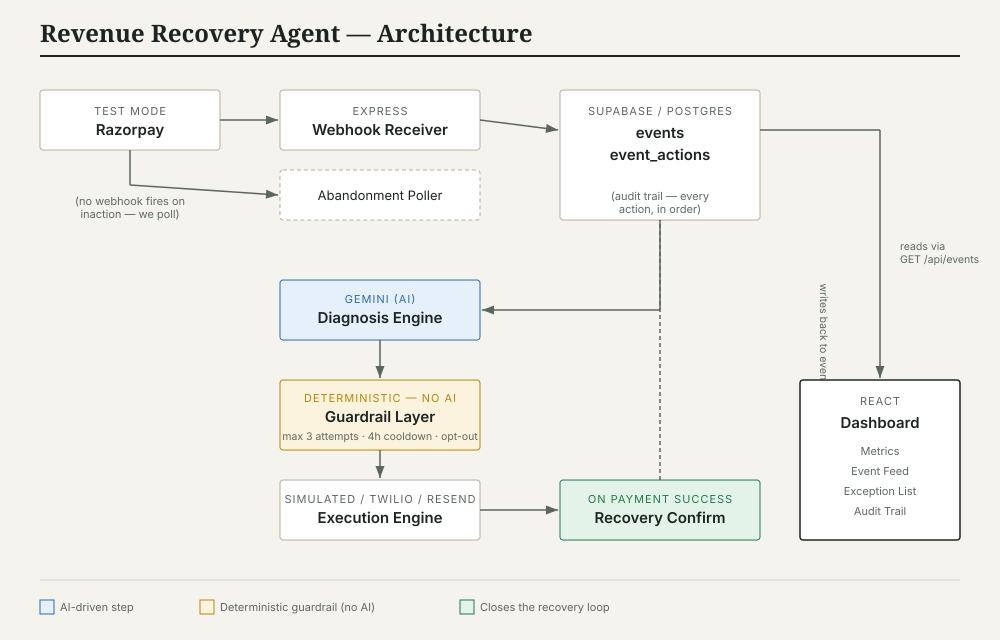

# AI Revenue Recovery Agent

A working system for Razorpay merchants that closes the revenue-leakage loop:
detects failed subscription payments and abandoned checkouts, diagnoses why with
Gemini, applies deterministic guardrails, sends recovery nudges, and tracks
results on a live dashboard.

## Problem

Merchants lose real revenue two silent ways: a subscription payment fails and
nobody follows up, or a customer starts checkout and simply never finishes.
Neither is loud — no one gets paged. This agent watches for both, figures out
why, and takes a bounded, logged recovery action instead of doing nothing.

## Architecture



The core design decision: **diagnosis is AI-driven, but the decision to act is
not.** Gemini figures out *why* something failed and *what* would help. A
separate, plain-code guardrail layer decides whether we're actually *allowed*
to act right now — max 3 attempts, 4-hour cooldown, permanent stop on opt-out.
Money-related actions are never left to a model's judgment alone.

## Tech stack

| Layer | Tool | Tier |
|---|---|---|
| Backend | Node.js + Express | Free |
| Database | Supabase (Postgres) | Free |
| AI (diagnosis + messaging) | Google Gemini API | Free |
| Frontend | React + Vite | Free |
| Payments | Razorpay Test Mode | Free |
| Local webhook tunneling | ngrok | Free |
| Optional messaging | Twilio WhatsApp Sandbox / Resend | Free tier |

Zero paid services required anywhere in the stack.

## What's built

- **Webhook receiver** — verifies Razorpay's HMAC SHA256 signature, ignores
  irrelevant events, logs everything received
- **Abandonment poller** — Razorpay doesn't fire a webhook for "nothing
  happened," so a separate poller finds stale unpaid checkouts
- **Diagnosis engine** — Gemini call with a structured prompt, defensively
  parsed (handles markdown-fenced JSON, retries on rate limits)
- **Guardrail layer** — deterministic, zero AI calls, fully unit-tested
  (9/9 passing): max attempts, cooldown, opt-out handling
- **Execution engine** — simulated messaging by default (zero signups needed),
  with real Twilio/Resend paths ready if you add those keys later
- **Recovery confirmation** — auto-matches successful payments back to the
  event that was nudged, idempotent
- **Dashboard** — ledger-styled UI: metric cards, filterable/paginated event
  feed, an honest exception list, and a receipt-style audit trail per event
- **Seed + batch runner** — generates 50+ realistic synthetic events and runs
  them through all 3 attempt rounds with simulated customer responses
- **Production hardening** — rate limiting, centralized error handling,
  request logging, startup credential validation, restricted CORS

## Quick start

**New to this?** Follow `SETUP-GUIDE.md` — it walks through Supabase, Gemini,
and Razorpay account setup from scratch, step by step.

### Backend
```
cd backend
cp .env.example .env    # then fill in your keys — see SETUP-GUIDE.md
npm install
npm run dev
```
Runs on http://localhost:4000. Run `backend/db/schema.sql` in your Supabase SQL
editor first.

### Frontend
```
cd frontend
cp .env.example .env
npm install
npm run dev
```
Runs on http://localhost:5173.

### Run all automated tests (no live keys needed)
```
cd backend
npm test
```
16/16 passing — 8 guardrail logic tests, 8 seed-data generator tests.

### Run the full demo batch (needs live Supabase + Gemini keys)
```
cd backend
npm run batch
```
Seeds 50 events, runs them through diagnose → decide → execute across all 3
attempts, simulates realistic customer responses, prints final numbers.

## Results

*Run `npm run batch` with your own keys and drop the printed summary here —
it prints a ready-to-use pitch line at the end of the run, e.g.:*

> Recovered ₹XX,XXX out of ₹XX,XXX at risk (XX.X% recovery rate) across 50
> events, with N escalations and an honest exception list of M unrecoverable
> cases.

## Optional: deploying

- **Backend** → Render or Railway (free tier). A `Dockerfile` is included in
  `backend/` if you want a containerized deploy; otherwise both platforms can
  run a Node app directly from the repo.
- **Frontend** → Vercel (free tier), pointed at your deployed backend URL via
  `VITE_API_BASE_URL`.
- Once deployed, set `FRONTEND_URL` in the backend's environment to your
  Vercel URL so CORS is properly restricted (see `server.js`).

## Project structure

```
/backend
  /routes         webhook.js, events.js
  /services       diagnose.js, decide.js, execute.js, confirmRecovery.js,
                  generateMessage.js, geminiClient.js, audit.js
  /scripts        seed.js, runPipeline.js, runBatch.js,
                  simulateRecoveries.js, detectAbandonment.js
  /middleware     errorHandler.js, rateLimiter.js
  /config         validateEnv.js
  /db             schema.sql, supabase.js
  /tests          decide.test.js, seed.test.js
/frontend
  /src/components Dashboard.jsx, EventFeed.jsx, ExceptionList.jsx,
                  AuditTrailModal.jsx, MetricStrip.jsx, StatusBadge.jsx
  /src/api        client.js
SETUP-GUIDE.md     beginner walkthrough for Supabase/Gemini/Razorpay
architecture-diagram.svg
```
# revenue-recovery-agent
